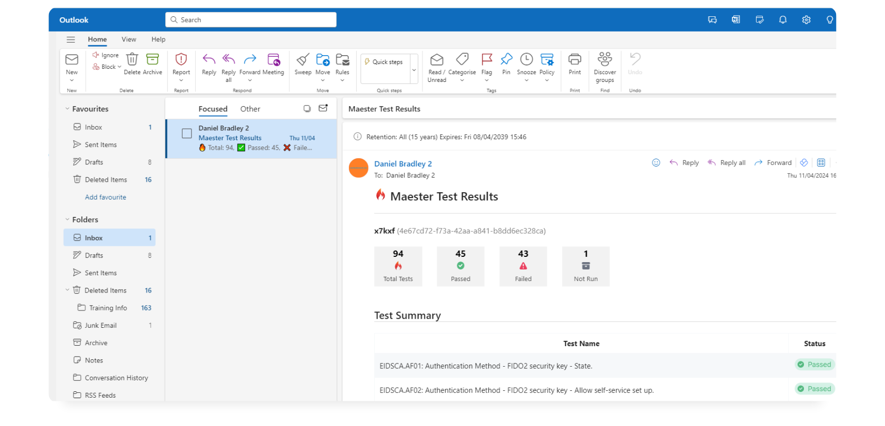

import GraphPermissions from '../sections/permissions.md';

# <IIcon icon="devicon:azure" height="48" /> Setup Maester in Azure Automation
This guide will walk you through setting up Maester in Azure Automation and automate the running of tests using Runbooks.

## Why Azure Automation?
Azure Automation provides a simple and effective method to automate email reporting with Maester. Azure Automation has a free-tier option, giving you up to 500 minutes of execution each month without additional cost.

### Pre-requisites
- If this is your first time using Microsoft Azure, you must set up an [Azure Subscription](https://learn.microsoft.com/en-us/azure/cost-management-billing/manage/create-subscription) so you can create resources and are billed appropriately.
- You must also have access to a **Global Administrator** account in your Entra tenant. This is so the necessary permissions can be consented to the Managed Identity you will create.

## Create an Azure Automation Account
- Log in to **[portal.azure.com](https://portal.azure.com)**.
- Search for and select **Automation Accounts**.
- Click **Create**.
- Select your **subscription** and **resource group**, then define the account **name** and **region**.
- Click **Next**.
- Leave **System assigned managed identity** selected and click **Next**.
- Click **Create**.

##  Assign permissions to the System-assigned Managed Identity
The necessary permissions must be assigned to the Managed Identity associated with the Automation Account. These are:

<GraphPermissions/>

If the automation needs to email the Maester report, the **Mail.Send** permission is also required.

```powershell
To do this, you will use the Microsoft Graph PowerShell SDK. Ensure you modify the first line with the name of your Automation Account.

```powershell
$ManagedIdentityName = "Automation Account Name Here"

$Scopes = @(
    "Application.Read.All",
    "AppRoleAssignment.ReadWrite.All"
)

Connect-MgGraph -Scopes $Scopes

$permissions =  @(
    "Directory.Read.All",
    "Policy.Read.All",
    "Reports.Read.All",
    "DirectoryRecommendations.Read.All",
    "PrivilegedAccess.Read.AzureAD",
    "Mail.Send"
)

$getPerms = (Get-MgServicePrincipal -Filter "AppId eq '00000003-0000-0000-c000-000000000000'").approles | Where {$_.Value -in $permissions}
$ManagedIdentity = (Get-MgServicePrincipal -Filter "DisplayName eq '$ManagedIdentityName'")
$GraphID = (Get-MgServicePrincipal -Filter "AppId eq '00000003-0000-0000-c000-000000000000'").id

foreach ($perm in $getPerms){
    New-MgBetaServicePrincipalAppRoleAssignment -ServicePrincipalId $ManagedIdentity.Id `
    -PrincipalId $ManagedIdentity.Id -ResourceId $GraphID -AppRoleId $perm.id
}
```
##  Load the required PowerShell modules
- Open your Automation Account from the Azure portal.
- Select **Runtime Environments**.
- Click **Create**.
- Define a name for the environment.
- Select **PowerShell** for the language and set the **Runtime version** to **7.2**.
- Click **Next**.
- On the **Packages** tab, click **Add from gallery** and select the following packages:
  - Maester
  - Microsoft.Graph.Authentication
  - Pester
- Click **Next**.
- Click **Create**.

## Create a new Runbook
- Under **Process Automation** click **Create**.
- Select **Create new** next to Runbook.
- Define a name for the Runbook.
- Next to Runbook type, select **PowerShell**, then choose the Runtime Environment you previously created.
- Click **Create**.
- Copy and paste this example code:

```PowerShell
Connect-MgGraph -Identity

#Define mail recipient
$MailRecipient = "Define Sender/Recipient"

#create output folder
$date = (Get-Date).tostring("yyyyMMdd-HHmm")
$FileName = "MaesterReport" + $Date + ".zip"

$TempOutputFolder = $env:TEMP + $date
if (!(Test-Path $TempOutputFolder -PathType Container)) {
    New-Item -ItemType Directory -Force -Path $TempOutputFolder
}

#Run Maester report
cd $env:TEMP
md maester-tests
cd maester-tests
Install-MaesterTests .\tests
Invoke-Maester -MailUserId $MailRecipient -MailRecipient $MailRecipient -OutputFolder $TempOutputFolder
```
- Click **Save**, then **Publish**.

## Create a schedule
- From the Azure Portal, open your Automation Account.
- Under **Shared Resources** select **Schedules**.
- Click **Add a schedule** and define a name.
- Set the Recurrence to **Recurring**.
- Select **Recur every 1 Month** and set **Run on last day of month** to **Yes**.
- Click **Create**.
- Under **Process Automation**, select **Runbooks** and open your Runbook.
- Click **Schedules** > **Add a schedule**.
- Choose your schedule and click **OK**.

## Viewing the test results


## Contributors
Author:
- [Daniel Bradley](https://www.linkedin.com/in/danielbradley2/) | Microsoft MVP

