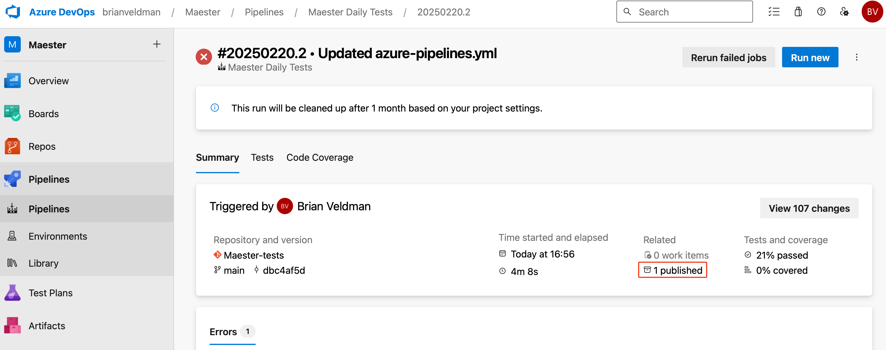
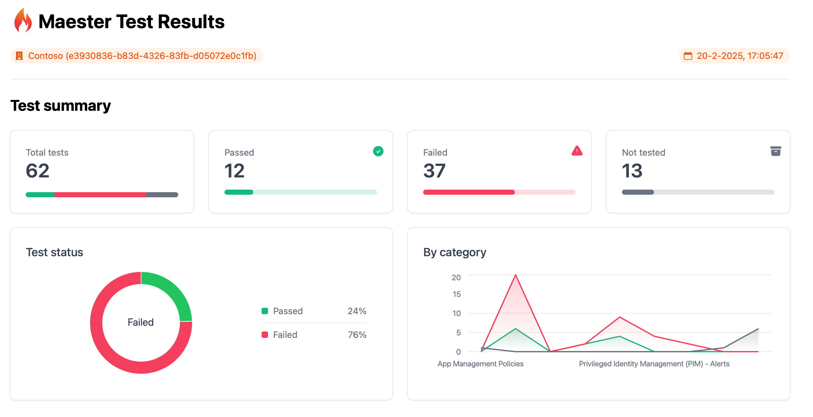
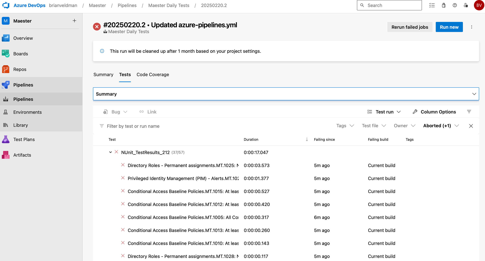

import Tabs from '@theme/Tabs';
import TabItem from '@theme/TabItem';
import GraphPermissions from '../sections/permissions.md';
import PrivilegedPermissions from '../sections/privilegedPermissions.md';
import CreateEntraApp from '../sections/create-entra-app.md';
import CreateEntraClientSecret from '../sections/create-entra-client-secret.md';

# <IIcon icon="vscode-icons:file-type-azurepipelines" height="48" /> Set up Maester in Azure DevOps

This guide will walk you through setting up Maester in Azure DevOps and automate the running of tests using Azure DevOps Pipelines.

## Why Azure DevOps & Terraform?

Azure DevOps is a great way to automate the daily running of Maester tests to monitor your tenant. You can use Azure DevOps to run Maester tests on a schedule, such as daily, and view the results in the Azure DevOps interface. 

Azure DevOps comes with a [free tier](https://azure.microsoft.com/pricing/details/devops/azure-devops-services/) that includes 1,800 minutes of Maester test runs per month (unlimited hours if you use a self-hosted agent).

Azure DevOps has native integration with Microsoft Entra including single sign on, user and group management as well as support for conditional access policies.

Terraform is an open-source Infrastructure as Code (IaC) tool used to configure and deploy infrastructure across platforms like AWS, GCP, and Azure. We've created a Terraform module to simplify and streamline the deployment of Maester to Azure DevOps.


### Pre-requisites

- If this is your first time using Azure DevOps, you will first need to create an organization.
  - [Azure DevOps - Create an organization](https://learn.microsoft.com/azure/devops/organizations/accounts/create-organization)
    :::tip
    To enable the free tier, to use a Microsoft-hosted agent, for Azure Pipelines you will need to submit this form https://aka.ms/azpipelines-parallelism-request (it can take a few days before you can use the pipeline.) In the interim you can use a [self-hosted agent](https://learn.microsoft.com/azure/devops/pipelines/agents/agents?view=azure-devops&tabs=yaml%2Cbrowser#self-hosted-agents) to get started.
    :::
- You must have the **Global Administrator** role in your Entra tenant. This is so the necessary permissions can be consented to the Managed Identity.
- You must have the permissions to create a temporary PAT (Personal Access Token) in Azure DevOps to deploy the necessary Azure DevOps resources.
- You must also have Terraform & Azure CLI installed on your machine:
  - [Azure CLI installation](https://learn.microsoft.com/en-us/cli/azure/install-azure-cli)
  - [Terraform installation](https://developer.hashicorp.com/terraform/tutorials/aws-get-started/install-cli)

## Terraform Module Deployment
To deploy, you can use the Maester Terraform Module:

Create a temporary PAT (Personal Access Token) with Full Access, that can be safely deleted after deployment. 

- `export AZDO_PERSONAL_ACCESS_TOKEN=<pat>`
- `export AZDO_ORG_SERVICE_URL=https://dev.azure.com/<devOpsOrganizationName>`

Define the Terraform Module: 

```terraform
module "maester" {
  source  = "maester365/maester/azuredevops"
  version = "1.0.0"
  azure_tenant_id = "tenantId"
  azure_subscription_id = "subscriptionId"
  azure_subscription_name = "subscriptionName"
  azure_devops_org_name  = "devOpsOrganizationName"
}
```

Initialize the Configuration:
- `terraform init -upgrade`

Plan and Apply:
- `terraform plan -out main.tfplan`
- `terraform apply main.tfplan`

## Viewing test results

- Select **Pipelines** > **Runs** to view the status of the pipeline
- Select on a run to view the test results

### Summary view

The summary view shows the status of the pipeline run, the duration, and the number of tests that passed, failed, and were skipped.



### Maester report

The Maester report can be downloaded and viewed by selecting the **Published** artifact.



### Tests view

The **Tests** tab shows a detailed view of each test, including the test name, duration, and status.




## Keeping your Maester tests up to date

The Maester team will add new tests over time. To get the latest updates, just simply redeploy the Terraform Module!

## Contributors

- Original author: [Brian Veldman](https://www.linkedin.com/in/brian-veldman/) | Technology Enthusiast
- Co-author: [Merill Fernando](https://www.linkedin.com/in/merill/) | Microsoft Product Manager